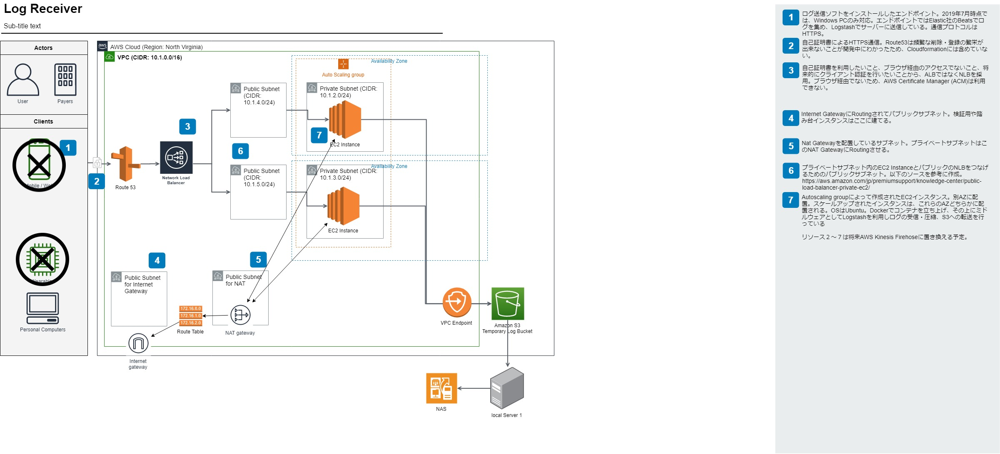
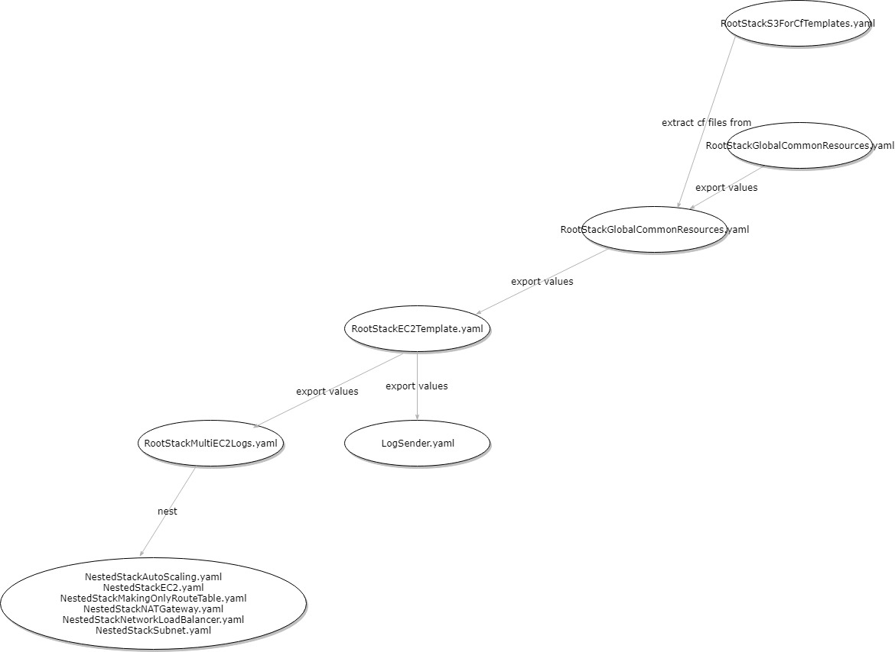

# aws_cloud_ログ受信システム

＊本システムは、過去に業務で構築したシステムから機密情報を削除したサンプルプログラムです。自分のプログラミング力を示すためのポートフォリオとして公開してたもので、動作確認は行っておりません。

# アーキテクチャ


# 概要説明

- 本システムは、PCなどのクライアントからHTTPS形式でログを受信しS3に溜めるシステムである。
- 本システムEC2インスタンスでは、Dockerコンテナが起動ており、Dockerfileで自動的にコマンドの実行と起動が行われる。(/dockerLogstash/DockerfileLogstashReceiverHTTPS参照)
-本システムEC2インスタンスのDockerコンテナでは、Logstashが起動しており、これがのログの受信と転送を行っている。
- 本システムは、Route53(DNSサーバーの更新が遅く構築と破壊をスムーズに行えないため)とAWS Systems Managerパラメータストア(DockerfileをGitLabプライベートリポジトリからCloneしており、リポジトリやCloudformationファイル上に機密情報を上げたくないため)以外は、全てCloudformationで立ち上がるようになっている。
- 本システムは、AWS完全未経験の状態から、業務時間の約85％を使い(残業多め)約4か月で構築した(AWS有料ビジネスサポート利用)。

## 各Cloudformation templateファイルの相関図


# ディレクトリ概要
```
|-- AWSCloudFormation
|   |-- CommonStack
|   |   |-- RootStackGlobalCommonResources.yaml　：最初に立ち上げるCloudformationファイル。IAMやS3など、リージョン感で共通につかるリソースを立ち上げる。
|   |   |-- RootStackRegionalCommonResources.yaml　：2つ目に立ち上げるCloudformationファイル。各リージョン内で立ち上げるときに必要になる。VPCやRoute Tableなど立ち上げ続けても課金されないリソースのみ作成する。
|   |   `-- RootStackS3ForCfnTemplates.yaml　：Cloudformationファイルを格納するS3バケットを作るCloudformationファイル。
|   |-- LogReceiver
|   |   |-- NestedStackAutoScaling.yaml
|   |   |-- NestedStackEC2.yaml
|   |   |-- NestedStackEC2Template.yaml
|   |   |-- NestedStackKinesisFirehose.yaml
|   |   |-- NestedStackNATGateway.yaml
|   |   |-- NestedStackNetworkLoadBalancer.yaml
|   |   |-- NestedStackSubnet.yaml
|   |   `-- RootStackMultiEC2Logs.yaml　：ログを受信するリソース群を立ち上げるRoot Stack
|   `-- LogSender
|       `-- LogSender.yaml　：テスト用に、ログを送信するリソース群を立ち上げるStack
|-- LICENSE
|-- README.md
|-- dockerLogstash　：EC2インスタンス上でコンテナを立ち上げるDockerfile。これらはGitlabリポジトリに格納されており、Cloudformationファイル内で呼び出されている。
|   |-- DockerfileLogstashReceiverHTTP
|   |-- DockerfileLogstashReceiverHTTPS
|   |-- DockerfileLogstashSenderHTTP
|   `-- DockerfileLogstashSenderHTTPS
|-- documents　：　アーキテクチャ図やCloudformationファイル相関図を格納する場所
|   |-- architecture
|   |   |-- AWS_cloudformation_template_relationship.drawio
|   |   `-- AwsCloudFormationStackRelations.drawio
|   `-- startup_manual.md
`-- pictures　：READMEや手順書に掲載されている画像を格納する場所。
    |-- AWS_logReceiver_Architecture.jpg
    |-- AwsCloudFormationStackRelations.jpg
    `-- startup_manual
        |-- AWSAccessKey.PNG
        |-- AWSSystemsManagerParameterStore1.PNG
        |-- EC2KeyPairs.PNG
        |-- LogreceiverCfn2.PNG
        |-- cloudFormationTop.PNG
        |-- delirekutori.png
        |-- runCloudformation1.PNG
        |-- runCloudformation2.PNG
        |-- runCloudformation3.PNG
        |-- runCloudformation4.PNG
        |-- runCloudformation5.PNG
        |-- runCloudformationRegionalCommonStack.PNG
        |-- s3FolderCreation.PNG
        `-- s3cfnTempFiles.PNG
```

# 実行方法 
以下マニュアルを参照
https://github.com/kensaku-okada/aws_cloud_log_collection/blob/master/documents/startup_manual.md

# 本システムの改善方法 
- 立ち上げているコンテナの権限をRootからUserに変更する。(現時点ではRootになっている。本番稼働時は権限を適切に絞る必要がある)
- 立ち上げているコンテナの脆弱性診断のために、TrivyやVulsなどの自動診断ツールなどで診断・デバッグする。
- 本システムの大部分をAWS Kinesis FirehoseかAWS Kinesis Streamに置き換える。どちらが適切かは要件次第(ログ受信後30秒以上の遅延が共用できるならAWS Kinesis Firehoseが良いと思われる)。ただし、この場合クライアントサイドのログ送信プログラムをAWS SDKやKCL(Kinesis Client Library)で書く必要がある。
- CloudformationのAWS::EC2::LaunchTemplateのUserDataをAWS::CloudFormation::Initに書き換える。これによってCloudformationの更新処理がより簡単になる。
- 外部のソース管理ツール(e.g. Gitlab Github)の代わりに、AWS Code Commitを使う。これによってクラウド上でのCICDを行いやすくなる。
- EC2の代わりにECSを使う。これによってよりシンプルにコンテナベースでシステムを管理できる(本システムではEC上にDockerをインストールしてコンテナ化している)。
